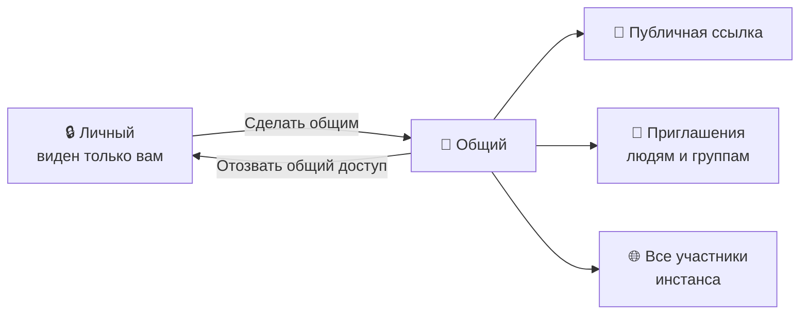

# 👥 Совместная работа

В karexo документ по умолчанию **личный**: его видите только вы. Чтобы поделиться, документ
сначала переводится в **общий** - один клик в диалоге «Поделиться».

## 🚪 Открыть доступ

Кнопка **«Поделиться»** в верхней панели. На личном документе появится карточка
«Документ личный» и кнопка **«Сделать общим»**. После неё откроются две вкладки:
**«Доступ по ссылке»** и **«Участники»** (рядом с названием - счётчик людей и групп).

Изменения применяются сразу - отдельной кнопки «Сохранить» нет.

## 🎭 Роли

| Роль | Что можно |
|---|---|
| **Просмотр** | Только читать |
| **Комментирование** | Читать и оставлять комментарии |
| **Редактирование** | Полные права на содержимое |
| **Владелец** | Всё вышеперечисленное плюс управление доступом; владелец один и не меняется |

Управлять доступом к документу может **только владелец**.

## 📧 Пригласить человека

На вкладке «Доступ по ссылке» внизу - поле **«Email пользователя…»** и выбор роли.

- Начните набирать имя или часть адреса - karexo подскажет сотрудников вашего инстанса.
- Если такого пользователя ещё нет, karexo **отправит приглашение на почту**. Доступ выдастся
  автоматически, как только человек зарегистрируется на этот адрес.
- Приглашённый получает уведомление, а документ появляется у него в разделе
  **«Доступные мне»**.

### Группы

Рядом с полем почты - выбор **группы**. Доступ выдаётся всей группе сразу и живёт по её
**текущему составу**: кого добавили в группу позже - получит документ сам, кого исключили -
сразу потеряет.

Группы заводит и ведёт администратор инстанса в настройках (раздел «Группы»).

### Все участники инстанса

На вкладке «Участники», раздел **«Общий доступ»**: строка «Все участники инстанса» - можно
выдать роль любому, кто вошёл в этот karexo, или оставить «Нет доступа».

## 🔗 Публичная ссылка

Тумблер **«Доступ по ссылке»** на одноимённой вкладке. Ссылка вида `…/s/<токен>` открывается
без входа в аккаунт.

| Настройка | Варианты |
|---|---|
| **Открывший ссылку может** | Просмотр / Комментирование / Редактирование |
| **Срок действия** | Бессрочно / 24 часа / 7 дней / 30 дней |
| **Скрыть от поисковиков** | Запрет индексации (`noindex`) |
| **Комментарии без входа** | Гости комментируют, не заводя аккаунт (доступно при роли «Комментирование» и выше) |

Что видит гость по ссылке:

- саму страницу, её иконку, обложку и комментарии;
- кнопку **«+ Добавить к себе»** (если он вошёл в аккаунт) - документ закрепится за ним
  и появится в «Доступные мне»;
- кнопку **«Запросить редактирование»** - владельцу придёт уведомление, и он выдаст роль
  сам, одной кнопкой.

> ⚠️ Ссылка - это доступ. Кто угодно, кому она попадёт, откроет документ, пока ссылка включена
> и не истекла. Выключение тумблера мгновенно закрывает доступ.

## 🚫 Отозвать доступ

- **У человека или группы** - на вкладке «Участники» щёлкните роль → «Убрать доступ».
- **Целиком** - внизу диалога **«Отозвать общий доступ»** (с подтверждением): ссылка
  выключается, все приглашения и общий доступ инстанса снимаются, документ снова становится
  личным.

Для зашифрованных документов отзыв ещё и **меняет ключ**: отозванный не прочитает то, что
будет написано после отзыва. Подробности - [🔒 Приватность и шифрование](privacy-encryption.md).

## 📥 Доступные мне

Раздел боковой панели со всем, чем поделились с вами. Правый клик по документу:

| Пункт | Что делает |
|---|---|
| **Открыть** / **Копировать ссылку** | Очевидное |
| **Создать копию у себя** | Независимая копия в «Моих заметках»; с оригиналом больше не связана |
| **Скрыть из списка** | Локально убрать с глаз (доступ остаётся) |
| **Отказаться от доступа** | Самоотзыв: сервер снимает ваш доступ, вернуть его сможет только владелец |

## 💬 Комментарии

- **К фрагменту текста** - выделите текст и нажмите 💬 на панели форматирования.
- **К блоку** - меню блока `⠿` → «Комментировать».
- **Все обсуждения страницы** - вкладка «Комментарии» правой панели; на иконке вкладки видно
  число нерешённых.

Возможности треда:

- ответы внутри треда;
- эмодзи-реакции;
- пометка **«решено»** - тред сворачивается;
- удаление своего комментария (владелец документа может удалять любые).

Комментарии едут вместе с документом: у участников общего документа они общие и защищены тем
же ключом, что и содержимое.

## 🔔 Уведомления

Колокольчик в верхней панели открывает центр уведомлений; на нём горит число непрочитанных.
Внутри - вкладки **«Все»**, **«Непрочит.»**, **«Упоминания»**, **«Комментарии»** и разбивка на
«Сегодня» и «Ранее». Типы событий:

| Тип | Когда приходит |
|---|---|
| **Упоминание** | Вас отметили через `@` |
| **Комментарий** | Ответили в треде к вашему блоку |
| **Доступ** | Вам открыли доступ или кто-то просит доступ у вас |
| **Дедлайн** | Сработало напоминание по дате |
| **Синхронизация** | Сервер недоступен или возник конфликт |

Что показывать - настраивается в **Настройки → Уведомления**. Запрос доступа можно решить
прямо из уведомления кнопкой «Разрешить».

## 🛡️ Роли инстанса

Роль в инстансе - это про администрирование, а **не** про доступ к чужим документам:
администратор без выдачи чужой документ не откроет.

| Роль | Кто это |
|---|---|
| **Владелец** | Тот, кто поднял инстанс и завёл первую учётную запись. Один и не сменяется |
| **Администратор** | Помогает вести пользователей и группы |
| **Участник** | Работает со своими документами и выданными доступами |

| Возможность | Владелец | Администратор | Участник |
|---|:---:|:---:|:---:|
| Видеть список пользователей | ✅ | ✅ | ❌ |
| Подтверждение почты, блокировка, сессии, квоты | ✅ | ✅ | ❌ |
| Создание и приглашение аккаунтов | ✅ | ✅ | ❌ |
| Группы: создание, состав, удаление | ✅ | ✅ | ❌ |
| Удаление аккаунтов вместе с данными | ✅ | ❌ | ❌ |
| Назначение ролей | ✅ | ❌ | ❌ |

Дополнительные правила: владельца не может тронуть никто, администратора - только владелец.

Матрица прав целиком видна в **Настройки → Роли и доступ**. Рядом живут разделы
**Пользователи**, **Группы** и **Сервер и синк**; данные в них видит тот, кому это положено по
роли - у обычного участника списки останутся пустыми.
