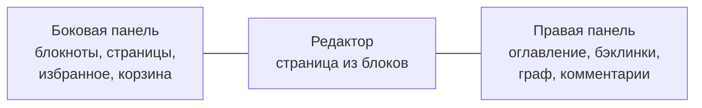

# 🚀 Начало работы

За десять минут вы заведёте аккаунт, создадите первую страницу и научитесь набирать блоки.

## 🔑 Первый вход

karexo открывается в браузере по адресу вашего сервера. Первым появляется экран **«Вход»**;
внизу формы - строка «Нет аккаунта? **Регистрация**», она и переключает на создание учётной
записи (обратно - «Уже есть аккаунт? Войти»).

### Регистрация

| Поле | Что вводить |
|---|---|
| **Сервер** | Не поле ввода, а напоминание: здесь показан адрес вашего инстанса - убедитесь, что он тот самый |
| **Логин** | Латинские строчные буквы, цифры и `_`, от 3 до 20 символов (например `mike` или `anna_k`) |
| **Почта** | Реальный адрес: на него придёт код подтверждения и письма о доступах |
| **Пароль** и **Повтор** | Минимум 8 символов, вводится дважды; глаз справа показывает набранное |

После нажатия «Создать аккаунт» вход выполняется сразу - отдельно логиниться не нужно.

### Подтверждение почты

Сразу после регистрации karexo отправляет на указанный адрес **код подтверждения** и
показывает экран «Подтвердите почту».

- Введите код из письма и нажмите «Подтвердить почту». Код действует **30 минут**, попыток
  ввода - пять; после этого просто запросите новый.
- Можно нажать «Подтвердить позже» - приложение откроется, а сверху останется ненавязчивый
  баннер с кнопкой «Ввести код». Нажатие на неё присылает свежий код (старый мог истечь).
- Подтверждённая почта нужна для восстановления пароля и приглашений в чужие документы.

### Вход и забытый пароль

В поле **«Логин или почта»** подойдёт и то, и другое. Ссылка «Забыли пароль?» спросит адрес
почты и пришлёт на него код: вводите код вместе с новым паролем, и karexo сразу пускает внутрь.
Код живёт 15 минут, повторную отправку можно запросить через минуту.

> ⚠️ Пароль от аккаунта и парольная фраза шифрования - **разные вещи**. Восстановление пароля
> не восстанавливает шифрование. См. [🔒 Приватность и шифрование](privacy-encryption.md).

## 🖥️ Что вы видите после входа



- **Верхняя панель** - путь до страницы, поиск, кнопка «Поделиться», меню страницы `⋯`.
- **Боковая панель** слева - дерево страниц. Сворачивается по `⌘\` / `Ctrl+\`.
- **Редактор** в центре - сама страница.
- **Правая панель** - вкладки «Оглавление», «Бэклинки», «Граф», «Комментарии», «Свойства», «Инфо».
- **Нижняя строка** - состояние синхронизации: «Синхронизировано», «Подключение…», «Офлайн».

### Разделы боковой панели

| Раздел | Что там |
|---|---|
| ⭐ **Избранное** | Страницы, помеченные звёздочкой |
| 🕘 **Недавние** | Что вы открывали в последнее время |
| 📁 **Блокноты** | Ваши папки; «Мои заметки» - дом по умолчанию, его нельзя удалить. Рядом лежат встроенные страницы справки и пример базы задач |
| 🔗 **Доступные мне** | Документы, которыми поделились с вами |
| 🧩 **Шаблоны** | Галерея заготовок для новой страницы |
| 🗑️ **Корзина** | Удалённые страницы: можно восстановить или убрать навсегда |

## 📄 Создание страницы

Три способа:

1. **«Новая страница»** внизу боковой панели - страница появится в «Моих заметках».
2. **Кнопка `+`** рядом с заголовком дерева - «Новая страница», «Импортировать…»,
   «Новая база данных», «Новый блокнот». **Правый клик по блокноту** даёт то же самое для
   конкретного блокнота, плюс переименование и удаление.
3. **Шаблоны** - готовые заготовки: «Пустая страница», «Заметки о встрече», «Список задач»,
   «Ежедневник», «План проекта».

Подстраница создаётся изнутри: наберите `/` и выберите **Подстраница** - вложенная страница
появится под текущей и сразу вставится ссылкой в текст.

### Заголовок, иконка, обложка

- Заголовок - первая строка страницы, набирается прямо там.
- Иконка и обложка выбираются на самой странице (пикер эмодзи и пикер обложки над заголовком).
- Всё это синхронизируется вместе со страницей.

## ✍️ Базовые блоки

Страница состоит из блоков. Enter создаёт новый блок, `Shift+Enter` - перенос строки внутри
текущего.

Самый быстрый путь - **набрать `/` в пустой строке**: откроется меню вставки с поиском.

Ещё быстрее - markdown-сокращения. Наберите в начале строки и продолжайте печатать:

| Набрать | Получится |
|---|---|
| `# ` | Заголовок 1 |
| `## ` | Заголовок 2 |
| `### ` | Заголовок 3 |
| `- ` или `* ` | Маркированный список |
| `1. ` | Нумерованный список |
| `[] ` или `[x] ` | Пункт чек-листа (второй - уже отмеченный) |
| `> ` | Цитата |
| ` ``` ` | Блок кода |
| `$$` | Блок-формула |
| `---` | Разделитель |
| `https://…` в пустом абзаце | Карточка-закладка |
| `$e=mc^2$` внутри строки | Формула прямо в тексте |

Полный список блоков, форматирование и горячие клавиши - в разделе [✍️ Редактор](editor.md).

## 💾 Сохранение и синхронизация

Кнопки «Сохранить» нет. Каждая правка сразу пишется в локальное хранилище браузера, а затем
уходит на сервер.

- **Офлайн** - работайте как обычно: правки скопятся и уедут, когда связь появится.
- **Несколько устройств** - изменения сливаются автоматически, без «кто последний, тот и прав»
  на уровне всей страницы.
- **Отмена** - `⌘Z` / `Ctrl+Z`, повтор - `⌘⇧Z` / `Ctrl+Shift+Z`.
- **История версий** - меню страницы `⋯` → «История версий»: версии нарезаны по паузам между
  правками, откат делается новыми правками и сам обратим.

## ⚙️ Полезные настройки в первый день

Настройки открываются из меню пользователя. Что стоит посмотреть сразу:

| Раздел настроек | Что там |
|---|---|
| **Профиль** | Имя, логин, почта и её смена, активные сессии, выход, экспорт всех данных |
| **Внешний вид** | Тема (светлая / тёмная / системная), цвет акцента, плотность интерфейса, моноширинный шрифт для кода, свечение, анимации |
| **Уведомления** | Упоминания, комментарии, дедлайны задач, ошибки синхронизации |
| **Горячие клавиши** | Список сочетаний с переключателем macOS / Windows |
| **Сервер и синк** | Адрес сервера и состояние связи, размер хранилища, частота синхронизации и **сквозное шифрование** |
| **О программе** | Версия сервера |

Тема переключается и без настроек: `⌘⇧L` / `Ctrl+Shift+L`.

## ➡️ Что дальше

- [✍️ Редактор](editor.md) - выжать максимум из блоков и клавиатуры.
- [🗂️ Базы данных](databases.md) - превратить список задач в доску, календарь или таблицу.
- [👥 Совместная работа](collaboration.md) - позвать коллег.
- [🔒 Приватность и шифрование](privacy-encryption.md) - включить сквозное шифрование.
