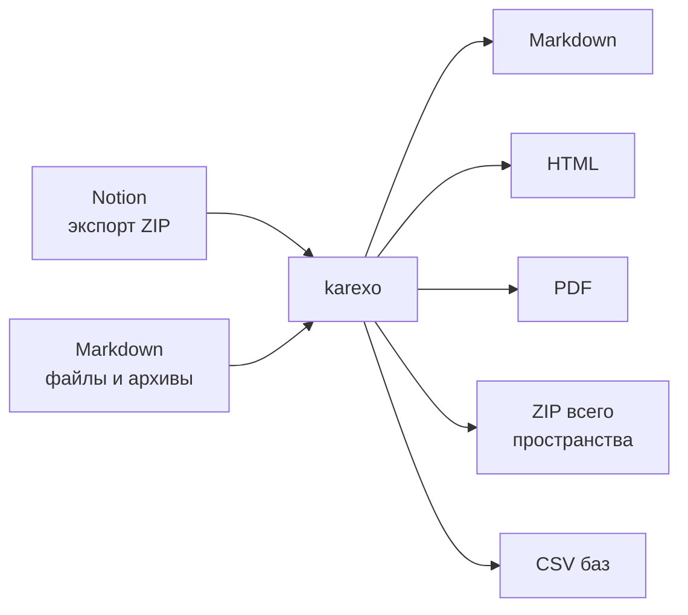

# 📦 Импорт и экспорт

Ваши заметки должны оставаться вашими - и когда вы приходите в karexo, и когда уходите.
Всё, что здесь описано, работает без плагинов и без «премиума».

## 📥 Импорт

Импорт запускается из боковой панели: кнопка `+` рядом с заголовком дерева или правый клик по
блокноту → **«Импортировать…»**. Страницы попадут в тот блокнот, из меню которого вы начали.

Принимаются файлы `.md`, `.markdown`, `.txt` и `.zip`.

### 📄 Один markdown-файл

Файл становится одной страницей. Заголовок берётся из имени файла, содержимое разбирается в
блоки: заголовки, списки, чек-листы, цитаты, разделители, блоки кода с языком, формулы
`$$…$$`, диаграммы ` ```mermaid ` и картинки ``. Жирный, курсив, `код` и ссылки внутри
строк сохраняются.

> ℹ️ Markdown-таблицы (строки с `|`) пока переносятся обычными абзацами - блоком-таблицей они
> не становятся.

### 🗜️ ZIP-архив

Архив распознаётся по содержимому, а не по расширению, поэтому неважно, как файл назван.

| Что за архив | Что получится |
|---|---|
| **Ваш архив karexo** (выгружен «Экспортом данных») | Восстанавливается не только текст, но и структура: дерево страниц, блокноты, иконки, обложки, избранное, теги, настройки страниц и порядок |
| **Чужой архив с markdown-файлами** | Файлы из корня становятся страницами в выбранном блокноте, файлы из подпапок - вложенными страницами |

Повторный импорт того же архива ничего не перетирает: создаётся вторая независимая копия
страниц. Единственное, что переиспользуется, - блокнот с тем же названием.

### 🧱 Экспорт Notion

Архив Notion распознаётся автоматически - выбирайте тот же zip, который вам отдал Notion
(в том числе «двойной», где внутри лежат части `ExportBlock-…-Part-N.zip`).

| Что в архиве Notion | Куда попадёт |
|---|---|
| Страницы (`.md`) | Обычные страницы karexo; вложенность по подпапкам сохраняется |
| Базы данных (`.csv`) | Базы данных karexo: первая колонка становится заголовком записи, типы остальных колонок определяются по значениям |
| Картинки | Переносятся вместе со страницами |
| Прочие вложения (PDF, архивы, видео) | **Не переносятся** - в отчёте об импорте видно, сколько таких файлов пропущено |

Хвост из 32 шестнадцатеричных символов, который Notion добавляет к именам, срезается из
заголовков автоматически.

По окончании karexo показывает отчёт: сколько страниц, баз, записей и картинок перенесено и
сколько файлов не удалось разобрать.

## 📤 Экспорт

### Одна страница

Меню `⋯` в верхней панели:

| Формат | Что это | Особенности |
|---|---|---|
| **Markdown** | Файл `.md` | Заголовки, списки, чек-листы, код с языком, таблицы, ссылки, картинки, формулы, диаграммы Mermaid в ` ```mermaid ` |
| **HTML** | Один автономный файл со встроенными стилями | Сохраняет всё, включая подчёркивание, выделение маркером и цвета текста и фона |
| **PDF** | Открывает диалог печати браузера | Сохраните «в PDF» - постраничные разрывы уже настроены |

Что стоит знать про Markdown:

- **подчёркивание, выделение маркером и цвета** формат markdown выразить не умеет - они
  остаются только в HTML-экспорте;
- **упоминания** выгружаются текстом `@Имя`;
- **формулы** - своим же исходником `$…$` и `$$…$$`;
- **рисунки** уезжают картинкой (SVG-превью), встроенное в файл;
- **колонки** разворачиваются в обычную последовательность блоков;
- **кнопка-заготовка** превращается в надпись и цитату с её содержимым;
- **страница-база** экспортируется шапкой со счётчиком записей - сами строки выгружаются
  из базы в CSV (см. ниже).

### Всё пространство

**Настройки → Профиль → Экспорт данных → «Экспорт»**.

Скачивается `karexo-export.zip`:

- каждая страница - отдельный `.md`;
- рядом `workspace.json` - снимок структуры: дерево, блокноты, иконки, обложки, избранное,
  теги и настройки страниц.

Этот же архив karexo умеет импортировать обратно с полным восстановлением структуры - удобно
и для переезда, и для резервной копии.

> 💡 Делайте такой экспорт периодически, особенно если включено сквозное шифрование: это
> самая простая страховка от забытой парольной фразы.

### База данных

Меню базы → **«Экспорт в CSV»**: все строки базы с человеческими значениями (метки вариантов,
имена людей, даты, результаты формул и итогов). Файл открывается в Excel без проблем с
кириллицей.

## 🔁 Переезд в karexo и из него



Форматы - обычные текстовые файлы. Ни один из них не требует karexo, чтобы быть прочитанным.
