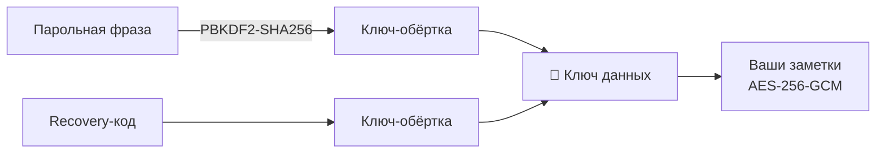

# 🔒 Приватность и шифрование

Это самый важный раздел справки: он про то, кто может прочитать ваши заметки и что произойдёт,
если вы забудете пароль. Прочитайте его **до** того, как включите шифрование.

## 🧭 Коротко

| Вопрос | Ответ |
| --- | --- |
| Где лежат данные | На вашем сервере karexo и в браузере каждого вашего устройства |
| Кто читает без шифрования | Вы и те, кому вы дали доступ. Технически - ещё и тот, у кого есть доступ к серверу |
| Кто читает с шифрованием | Только тот, у кого есть парольная фраза (или ключ документа) |
| Может ли сервер восстановить фразу | **Нет.** Он её никогда не знает |
| Что спасёт при забытой фразе | Только **recovery-код**, выданный при включении |
| Можно ли выключить шифрование | Да, но необратимо |

## 🗝️ Что такое сейф

**Сейф** - это ваша парольная фраза плюс ключ, которым шифруются данные. Все органы управления
им живут в одном месте: **Настройки → Сервер и синк → Сквозное шифрование (E2E)**. Там же
кнопка **«Включить»**, а после включения рядом появляется зелёная пометка «включено».

Как это устроено:

- Из парольной фразы выводится ключ-обёртка (**PBKDF2-SHA256, 600 000 итераций**, со случайной
  солью).
- **Recovery-код** - 32 случайных байта, записанных группами по четыре символа через дефис. Он
  сам по себе достаточно случайный, поэтому служит вторым ключом-обёрткой.
- Обе обёртки закрывают **один и тот же ключ данных**. Именно им шифруется содержимое
  (**AES-256-GCM**).
- На сервере хранится «конверт»: параметры вывода ключа и две обёртки. Развернуть их без вашей
  фразы или recovery-кода нельзя.
- Сам ключ данных живёт **только в оперативной памяти** после разблокировки.

### Recovery-код

Показывается **один раз**, сразу после включения шифрования. Скопируйте и сохраните его
отдельно от компьютера - менеджер паролей, бумажка в сейфе, что угодно надёжное. Повторно
karexo его не покажет: у него нет открытой копии.

Перевыпустить код можно в любой момент (кнопка **«Recovery-код»** там же, в разделе «Сервер и
синк») - потребуется парольная фраза, а старый код сразу перестанет действовать.

### Смена парольной фразы

Кнопка **«Сменить пароль»** рядом: нужна текущая фраза и новая (тоже от 8 символов).
Recovery-код при этом **остаётся прежним** - он закрывает тот же ключ данных.

## 🔓 Разблокировка

Ключ живёт в памяти, поэтому после перезагрузки браузера karexo просит фразу на отдельном
экране. Пока сейф заперт, приложение не открывается - так заметки не попадут в хранилище мимо
шифрования. Вместо фразы можно ввести recovery-код.

### «Запомнить на этом устройстве»

Кнопка **«Запомнить»** в настройках (и галочка «Запомнить на этом устройстве» на экране
разблокировки) сохраняет ключ в браузере устройства, чтобы больше не вводить фразу.

> ⚠️ Честная цена: **доступ к устройству = доступ к вашим заметкам**. Включайте только на
> личной машине с блокировкой экрана. Отключается кнопкой «Забыть».

## 🛡️ Что именно шифруется

| Данные | С включённым сейфом |
| --- | --- |
| Текст страниц, блоки, свойства, комментарии | 🔒 Зашифрованы |
| Заголовки страниц, дерево блокнотов, иконки и обложки | 🔒 Зашифрованы (список страниц - такой же документ) |
| Вложения: картинки, файлы, PDF | 🔒 Шифруются на устройстве до отправки |
| Имя и тип файла вложения | 🔒 На сервер уходят нейтральными (`blob.bin`), настоящие - внутри зашифрованных данных |
| Локальная копия в браузере | 🔒 Тоже шифруется |
| Поиск по заметкам | 💻 Работает локально, в браузере - запросы на сервер не уходят |

### Что сервер видит всегда

Даже при включённом шифровании сервер знает:

- **кто вы**: логин, имя, адрес почты, время входов и активные сессии;
- **что документ существует**: его идентификатор, владельца, время и количество правок,
  их размер;
- **кому открыт доступ**: список участников, групп, роли, публичные ссылки и их срок;
- **что есть вложение**: его размер и время загрузки.

Он **не видит** текст, заголовки, свойства, комментарии и содержимое файлов.

## ⏳ Важная граница: шифрование не задним числом

Сквозное шифрование защищает то, что записано **после** его включения.

Всё, что успело уехать на сервер раньше, сервер уже видел в открытом виде - переписать эту
историю нельзя. Поэтому:

- если приватность критична, **включайте шифрование сразу**, до наполнения базы;
- на существующей базе новые правки будут зашифрованы, а старые записи останутся как есть.

## 👥 Шифрование и совместная работа

У **общего** документа появляется собственный ключ документа - отдельный от вашей личной
фразы. Он нужен, чтобы участники читали документ, не зная вашего пароля.

- Ключ документа заворачивается **под каждого участника лично**, по его публичному ключу.
- Для публичной ссылки ключ кладётся в **якорную часть адреса** (`…/s/токен#k=…`). Браузер эту
  часть серверу не отправляет - поэтому по ссылке всё читается, а сервер по-прежнему хранит
  шифртекст.
- Когда вы **убираете участника**, ключ документа обновляется: отозванный не прочитает того,
  что появится дальше.

> ⚠️ Из этого следует практическое: **ссылка с ключом - это и есть ключ**. Пересылайте её так
> же аккуратно, как пароль, и выключайте, когда она больше не нужна.

### Участник без своего сейфа

Если вы делитесь зашифрованным документом с человеком, у которого сейфа нет, karexo заводит
ему ключ прямо на устройстве, чтобы документ просто открылся. Такой ключ **не защищён
парольной фразой**: доступ к его устройству = доступ к документу. Содержимое при этом всё
равно не видно серверу.

Если у участника пока нет ключа вовсе, доступ выдастся сразу, а зашифрованное содержимое
откроется автоматически, когда он войдёт в рабочее пространство.

## 💀 Что будет, если потерять пароль

Здесь karexo ничем не поможет - и это не недоработка, а смысл сквозного шифрования.

| Ситуация | Итог |
| --- | --- |
| Забыли фразу, есть recovery-код | ✅ Разблокируйте кодом и сразу смените фразу |
| Забыли фразу, recovery-код утерян | ❌ **Зашифрованные заметки восстановить невозможно** - ни вами, ни администратором сервера |
| Сейф «запомнен» на устройстве, но фраза забыта | ⚠️ Пока устройство работает - данные доступны. Немедленно смените фразу или выпишите новый recovery-код |
| Забыли пароль **от аккаунта** | ✅ Восстанавливается по почте и шифрования не касается |

Сброс пароля аккаунта **не** сбрасывает парольную фразу шифрования: это два разных секрета.

### Чек-лист безопасности

- ✅ Сохранить recovery-код сразу, вне устройства.
- ✅ Проверить, что фраза где-то записана (менеджер паролей), а не только в голове.
- ✅ Перевыпустить recovery-код, если он мог попасть в чужие руки.
- ✅ Делать периодический экспорт: [📦 Импорт и экспорт](import-export.md) → «Экспорт данных»
  выгружает всё пространство в архив с обычными markdown-файлами.

## 🔻 Выключение шифрования

**Настройки → Сервер и синк → Выключить шифрование.** Действие двухшаговое и **необратимое**;
пока идёт расшифровка, видно счётчик «столько-то из стольких-то».

Что произойдёт:

1. Каждый документ расшифруется на устройстве и уйдёт на сервер **в открытом виде**.
2. Парольная фраза и recovery-код перестанут быть нужны.
3. Сервер снова сможет читать содержимое.

Данные при этом не теряются. Но автоматически «зашифровать всё обратно» нельзя - можно только
включить шифрование заново, и защищено будет опять лишь то, что записано после включения.

Сейф должен быть разблокирован: если он заперт, karexo честно откажет и попросит ввести фразу.

## ❓ Частые вопросы

**Может ли администратор сервера прочитать мои заметки?**
Без шифрования - технически да, у него есть доступ к базе. С шифрованием - нет: он видит только
шифртекст.

**Работает ли karexo офлайн?**
Да. Правки копятся в браузере и уезжают на сервер, когда связь появится.

**Что происходит при выходе из аккаунта?**
Ключ удаляется из памяти, а локальное хранилище отвязывается от пользователя - на общем
компьютере после работы стоит выходить.

**Шифруются ли картинки?**
Да, если сейф разблокирован или документ общий и имеет свой ключ. Ограничение на один файл -
25 МБ.
